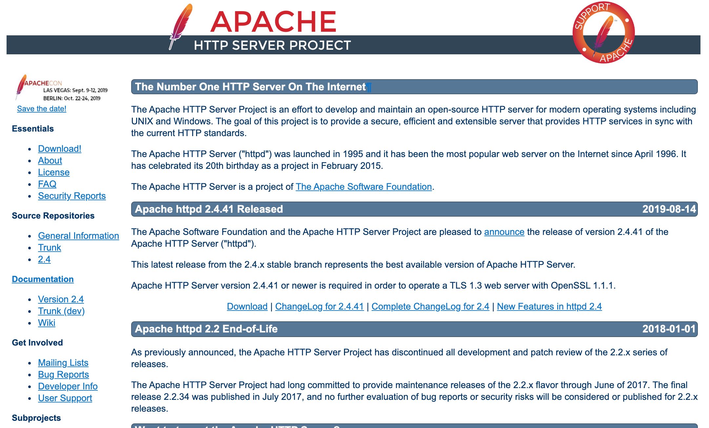

# Apacheのインストール

## ■ WebサーバーとWebブラウザ

Webページ閲覧にはWebブラウザを使います。  
ブラウザにはChromeやSafariといった様々なブラウザがあります。  
ブラウザの基本的機能は、Webサーバーにアクセスして、WebサーバーからWebページの情報を取得して画面上に表示します。  
通信にはHTTPというプロトコルを使い、Webサーバーは通常、80番ポートを使います。

## ■ Apache HTTP Server

Linuxで使われているWebサーバーとしてもっとも高いシェアを持つのは**Apache HTTP Server**(略してApache)です。  
Apacheは様々なオープンソフトウェアを開発しているApache財団が開発しているソフトウェアです。

- Apache HTTP Server のWEBサイト  
    

Apacheにはいくつものバージョン系統がある。大きく分けて、2.0系、2.2系、2.4系があり、centOS7では2.4系が採用されている。  
バージョンが異なると機能や設定がことなるが「2.2」「2.4」の部分が同じであれば、大きな違いはないと考えてよい。  
現在の最新バージョンは`2.4.41`だが、centOS7では`2.4.6`が採用されている。

## ■ Apacheのインストール

`yum` コマンドを使ってインストールします。  
パッケージ名は、`httpd` です。

``` shell
$ sudo yum -y install httpd

(以下省略)

インストール:
  httpd.x86_64 0:2.4.6-90.el7.centos

依存性関連をインストールしました:
  apr.x86_64 0:1.4.8-5.el7                          apr-util.x86_64 0:1.5.2-6.el7
  httpd-tools.x86_64 0:2.4.6-90.el7.centos          mailcap.noarch 0:2.1.41-2.el7

完了しました!
```

インストールができました。

## ■ インストールの確認

以下のコマンドで確認できる。

``` shell
$ sudo yum list installed | grep httpd

httpd.x86_64                          2.4.6-90.el7.centos              @base
```

また、以下のように実行することでインストールパスを確認できる。

``` shell
$ which httpd

/usr/sbin/httpd
```

実行結果として上記のようにhttpdのパスである「`/usr/sbin/httpd`」が表示されることを確認する。  
これでhttpdのインストールが正常に終了したことが確認できる。  

<a href="../../README.md">戻る➡︎</a>
