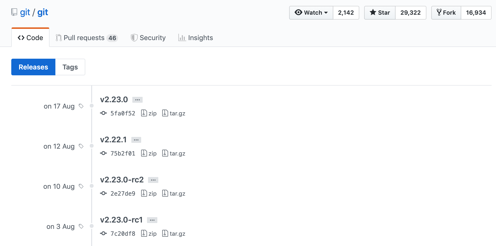

# centOSでgitの最新版をインストールする

- 実行環境
    - CentOS Linux release 7.6.1810 (Core)

## ■ パッケージマネージャーのgitは古いことが多い

`yum`や`apt`でインストールしたgitは古いことが多いです。  
特に`yum`でインストールした場合は古いみたい...

``` shell
$ git --version
git version 1.8.3.1
```

gitのバージョンが古くても最低限のことは問題ないが、新しいバージョンで追加された機能を使いたいときには、やはり最新版をインストールしておきたい。

## ■ 既存のgitをアンインストールする

すでにgitをインストールしてる場合はアンインストールします。

``` shell
$ sudo yum -y remove git
```

## ■ gitのインストール

### １. 必要なライブラリのインストール

- centOSの場合

    ``` shell
    $ sudo yum -y install curl-devel expat-devel gettext-devel openssl-devel perl-devel zlib-devel autoconf asciidoc xmlto docbook2X make gcc
    $ sudo ln -s /usr/bin/db2x_docbook2texi /usr/bin/docbook2x-texi
    ```

- Ubuntuの場合

    ``` shell
    $ sudo apt -y install libcurl4-gnutls-dev libexpat1-dev gettext libz-dev libssl-dev autoconf asciidoc xmlto docbook2x make gcc
    ```

### ２. ソースコードをダウンロード

gitのソースコードをダウンロードします。  
下記からGitHubのページにアクセスしてください。

- [Releases git/git](https://github.com/git/git/releases)



最新版の Tarball のダウンロードリンクをコピーします。  
上記の画像の例では、v2.23.0 が最新版なので、v2.23.0 の tar.gz のリンクをコピーします。  
以降の説明では、v2.23.0 が最新版だと仮定します。

Tarball をダウンロードします。

``` shell
$ wget https://github.com/git/git/archive/v2.15.1.tar.gz
```

- wgetコマンドが使えない場合

    下記リンクからwgetコマンドをインストールしてください。  

    - <a href="../wget/README.md">wgetをインストールする</a>

カレントディレクトリに v2.23.0.tar.gz がダウンロードされます。

### ３. Tarballを展開する

先ほどダウンロードした Tarball を展開します。

``` shell
$ tar -zxf v2.23.0.tar.gz
```

展開されたディレクトリに移動します。

``` shell
$ cd git-2.23.0
```

### ４. ビルドしてインストール

あとは、ビルドしてインストールすれば完了です。

``` shell
$ make configure
$ ./configure --prefix=/usr
$ make all doc info
$ sudo make install install-doc install-html install-info
```

### ５. 確認

バージョンを確認して、最新の Git のバージョンが表示されたら成功です。

``` shell
$ git --version
git version 2.23.0
```
