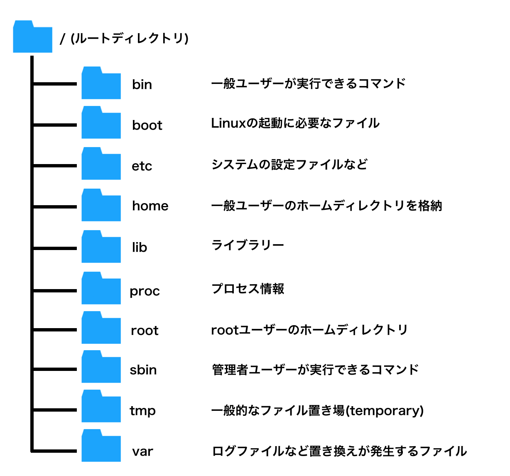

# ファイルとディレクトリの操作

ここではLinuxでのファイルとディレクトリの操作を紹介します。

## ■ Linuxのファイル

Linuxで扱うファイルを分類すると４種類になります。

- ファイルの種類

    |ファイルの種類|説明|
    |---|---|
    |通常ファイル|文字列が書き込みできるテキストファイルと、プログラムとデータが格納されるバイナリファイル|
    |ディレクトリ|ファイルを格納するフォルダ|
    |リンクファイル|ファイルに別名をつける仕組み。ハードリンクとシンボリックリンクがある。|
    |特殊ファイル|デバイスを表すデバイスファイルや特殊な用途のファイル。|

通常ファイル、ディレクトリ、リンクファイルはWindowsでもあるが、デバイスファイルはUNIX系OS特有です。  
Linuxでは、全てをファイルで表します。全てをファイルとして抽象化することで、デバイスの扱いをシンプルにしています。  
Windows等では「.txt」「.exe」といった拡張子(接尾辞)が意味を持ち、アプリケーションと関連付けられていますが、Linuxではファイル名の一部にすぎない。  
Linuxでのファイル名は大文字・小文字が区別されます。また「.」で始まる名前のファイルやディレクトリは隠しファイルとなり通常の操作では表示されません。そういったファイルの多くは設定ファイルである。(安易に消さないように)

## ■ ディレクトリの構造

Linuxでは、ディレクトリがツリー状の階層構造(ディレクトリツリー)になっています。  
全てのディレクトリの頂点、つまりディレクトリのトップをルートディレクトリといいます。ルートディレクトリは「`/`」で表します。

- Linuxの主なディレクトリ  
    

ファイルやディレクトリの場所はパスで表します。  
ルートディレクトリを起点として表す絶対パスと、カレントディレクトリを起点として表す相対パスがある。  
コマンドでファイルやディレクトリを操作する際はどちらでも構わない。

### ● 絶対パス

`/` ではじまり、目的のファイルやディレクトリまで`/` で区切って表す。  
絶対パスはファイルやディレクトリを一意に(重複無し)指定できる。

### ●　相対パス

コマンドライン操作では、ユーザーはいずれかのディレクトリを作業場所としており、そのディレクトリをカレントディレクトリという。  
相対パスは、カレントディレクトリを起点としてファイルやディレクトリまでの道筋を表します。

- カレントディレクトリの確認  
    カレントディレクトリは`pwd` コマンドで確認できる。

    ``` shell
    $ pwd
    /home/hoge
    ```

### ● ホームディレクトリ

ユーザーがログインした時のカレントディレクトリをホームディレクトリという。  
Linuxでは`/home/ユーザー名` がホームディレクトリになる。  
ホームディレクトリはユーザーの専用スペースで他ユーザーは干渉できないようになっている。

## ■ ファイル操作コマンド

### ● ファイルの一覧の表示

- 書式  
    `ls [オプション] [ファイル名やディレクトリ名]`

オプションなしで実行するとカレントディレクトリにあるファイル一覧が表示されます。  
ディレクトリを指定するとディレクトリ内のファイル一覧が表示されます。

詳細な情報をみるには`-l` オプションを使う。

``` shell
$ ls -l
# ・・・省略・・・
drwxr-xr-x.  19 root root  267  9月 17 07:12 var
```

左から、

- ファイルの識別とアクセス権
- リンク数
- ファイルの所有者
- ファイルの所有グループ
- ファイルサイズ
- 最終更新日時
- ファイル名

詳しくは下記、外部ページを参照してください。

- [lsコマンドの使い方](https://eng-entrance.com/linux_command_ls)

### ● ファイルをコピーする

- 書式  
    `cp コピー元ファイル名 コピー先ファイル名`

コピー先にディレクトリ名を指定すると同じファイル名でコピーされます。  
ディレクトリ名として`.` を指定するとカレントディレクトリの意味になる。

``` shell
# /etc/hots ファイルをhots2でコピー
$ cp /etc/hots hots2

# /etc/hots ファイルをカレントディレクトリに同じファイル名でコピー
cp /etc/hots .
```

詳しくは下記、外部ページを参照してください。

- [cpコマンドの使い方](https://eng-entrance.com/linux_command_cp)

### ● ファイルを移動する

- 書式  
    `mv 移動元ファイル名 移動先ファイル名`

``` shell
# hots2を/tmpに移動
$ hots2 /tmp
```

`mv` コマンドの場合、移動元ファイルは削除されるので、そのファイルを削除する権限がない場合は実行が失敗します。

また、`mv` コマンドはファイル名を変更する場合にも使用します。

- 書式  
    `mv 元ファイル名 新ファイル名`

``` shell
# hots2をrenamehotsに変更
$ mv hots renamehots
```

詳しくは下記、外部ページを参照してください。

- [mvコマンドの使い方](https://eng-entrance.com/linux_command_mv)

### ● ファイルの削除

- 書式  
    `rm ファイル名`

ファイルを削除するには、`rm` コマンドを使います。  
確認メッセージもなく、ゴミ箱等もないので慎重に削除してください。

``` shell
# renamehotsを削除
$ rm renamehots
```

詳しくは下記、外部ページを参照してください。

- [rmコマンドの使い方](https://eng-entrance.com/linux_command_mv)

### ● ファイルの種類を確認

- 書式  
    `file ファイル名`

## ■ ファイル閲覧コマンド

テキストファイルの内容を表示するには、`cat` コマンドを使います。

- 書式  
    `cat ファイル名`

``` shell
# OSのバージョンを確認
$ cat /etc/redhat-release
CentOS Linux release 7.6.1810 (Core)
```

詳しくは下記、外部ページを参照してください。

- [catコマンドの使い方](https://eng-entrance.com/linux_command_cat)

catコマンドでは行数が多いファイルの場合あっという間にスクロールされてしまいます。  
その場合は、`less` コマンドを使います。
`less` コマンドを使うと、最初の１画面文が表示されます。スペースキーで次のページが見れます。また、カーソルキーで上下でスクロールできます。

- 書式  
    `less ファイル名`

`less` コマンドは、`Q` キーを押すまで終了しません。  
less コマンド実行中の操作を下記表に記します。  

- 主な操作

    |キー操作|説明|
    |---|---|
    |`SPACE`|次のページを表示|
    |`↑`|上方向に１行スクロールする|
    |`↓`|下方向に１行スクロールする|
    |`F`|次のページを表示|
    |`B`|前のページを表示|
    |`Q`|lessコマンドを終了する|

## ■ ディレクトリ操作コマンド

### ● ディレクトリの作成

ディレクトリを作成するには、`mkdir` コマンドを使います。

- 書式  
    `mkdir ディレクトリ名`

``` shell
# sampleディレクトリの作成
$ mkdir sample
```

### ● ディレクトリのコピー

ディレクトリをコピーするには、`cp` コマンドの`-r` オプションを使います。

``` shell
# sampleディレクトリをsample2でコピーする
$ cp -r sample sample2
```

### ● ディレクトリの削除

ディレクトリを削除するには、`rmdir` コマンドを使います。

- 書式  
    `rmdir ディレクトリ名`

ここで注意なのがディレクトリ内にファイルが残ってないようにします。  
ファイルごと削除するには、`rm` コマンドの`-r` オプションを使います。

- 書式  
    `rm -r ディレクトリ名`

``` shell
# sample2ディレクトリを削除
$ rm -r sample2
# 確認なしでsampleディレクトリを削除
$ rm -rf sample
```

## ■ 圧縮ファイルの展開

Linuxでよく使用される圧縮ファイルは４種類存在する。  
それぞれの形式は拡張子で区別できる。  

- ファイルの圧縮・展開コマンド

    |拡張子|圧縮コマンド|展開コマンド|
    |---|---|---|
    |.zip|`zip`|`unzip`|
    |.gz|`gzip`|`gunzip`|
    |.bz2|`bzip2`|`bunzip2`|
    |.xz|`xz`|`xz -d`|

多くは、gzip もしくはbzip2 による圧縮です。  
最近ではxz も使われるみたいです。

### ● ファイルを圧縮・展開する例

``` shell
# sample.txtを作成
$ echo hello hoge > sample.txt

# sample.txtをsample2.txtでコピー
$ cp sample.txt sample2.txt

# sample2.txtをbzip2で圧縮
$ bzip2 sample2.txt

# 確認
$ ls
sample.txt  sample2.txt.bz2

# 展開
$ bunzip2 sample2.txt.bz2
```

## ■ アーカイブの作成と展開

ディレクトリを圧縮する場合は、あらかじめ複数ファイルを１つのファイルにまとめたアーカイブ(書庫)を作成し、そのアーカイブを圧縮します。  
アーカイブの管理には`tar` コマンドを使います。

- 書式  
    `tar オプション ディレクトリ`

- 主なオプション

    |オプション|説明|
    |---|---|
    |`-c`|アーカイブを作成する|
    |`-x`|アーカイブを展開する|
    |`-f ファイル名`|アーカイブファイルを指定する|
    |`-z`|gzip の圧縮を行う|
    |`-j`|bzip2 の圧縮を行う|
    |`-J`|xz の圧縮を行う|
    |`-t`|アーカイブの内容を表示する|
    |`-v`|詳しく表示する|

### ● アーカイブ作成例

`sample`ディレクトリを`test.tar`でアーカイブを作成します。

``` shell
# アーカイブ作成
$ tar -cvf test.tar sample
```

### ● アーカイブを作成し圧縮する例

`sample`ディレクトリを`test.tar`でアーカイブを作成し、`.bz2` で圧縮します。

``` shell
# アーカイブ作成し圧縮する
$ tar -czvf test.tar.bz2 sample
```

### ● 圧縮したアーカイブを展開する例

`test.tar.bz2` を展開します。

``` shell
# test.tar.bz2 を展開する
$ tar -zxvf test.tar.bz2
```

<a href="../../README.md/#ttl3-5">戻る➡︎</a>
