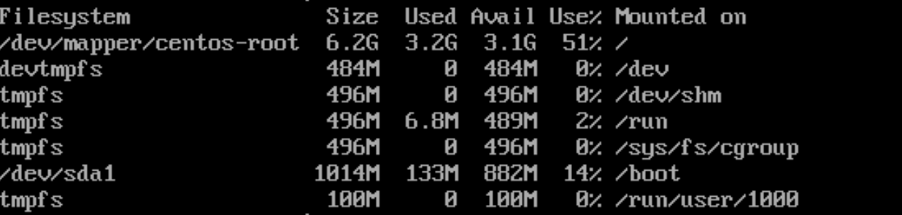

# 基本的なサーバー管理

ここではLinuxでの基本的なサーバー管理について紹介します。

## ■ システム負荷の確認

サーバーが十分に仕事をこなしているかどうかは気になります。  
`uptime` コマンドを実行すると、システム負荷を確認する事ができます。

``` shell
$ uptime
 17:21:39 up 0 min,  1 user,  load average: 0.49, 0.15, 0.05
```

load averageの欄に着目してください。3つの数値が並んでいますが、これは過去１分間、５分間、１５分間における負荷を示しています。  
この数値がCPU数(CPUコア数)以下であれば、おおむね問題ありません。  
例えばCPU数が２の場合は、2.00が目安です。その目安を超える数値が一時的ではなく続くようなら、サーバーのスペックが足りていません。  
その場合は、サーバー上で稼働している処理を見直すか、ハードウェアを増設する等検討する必要があります。

- 物理 CPU の数
    - 以下のコマンドを実行すると、システム上のアクティブな物理プロセッサーの数が表示されます。たとえばこの物理プロセッサーが 2 の場合、システムシャーシを開いて2 つの物理プロセッサーを手で取り外すことができます。

    ``` shell
    $ grep physical.id /proc/cpuinfo | sort -u | wc -l
    2
    ```

- CPU ごとのコアの数
    - マルチコアプロセッサーを持つシステムで以下のコマンドを実行すると、1 つの物理プロセッサーに CPU コアがいくつあるかが報告されます (ごく稀に報告されない場合もあります)。たとえば、物理プロセッサーの CPU コアが 4 つで物理 CPU が 2 つの場合は、2 つの物理プロセッサーのそれぞれが 4 つの CPU コアを持つため全部で 8 コアになります。

    ``` shell
    $ grep cpu.cores /proc/cpuinfo | sort -u
    cpu cores :4
    ```

- 論理プロセッサーの数
    - このコマンドを実行すると、Linux カーネルが表示する「論理」プロセッサーの総数が表示されます。通常、 この数字は 3 つの中で一番大事なものとなります。これは有効なプロセッサーの数です。オペレーティングシステムにとって、これは指定したマイクロ秒で動作できる CPU の数になります。たとえば、上述のシナリオでは、以下に示される数は 8 ではなく 16 になります。たとえば、このコマンドが示す結果が CPU コアの総数と異なる場合は、CPU でハイパースレッド処理が有効になっていて、各コア (この例では 2 つの使用可能な「スレッド」) に分配されるのが原因となります。

    ``` shel
    $ grep processor /proc/cpuinfo | wc -l
    16
    ```

## ■ ディスク使用状況の確認

ディスク使用状況を確認するには、`df` コマンドを使います。

``` shell
$ df
```


ファイルシステム(パーティション)ごとに表示されます。  
バイト単位で見づらいので、M・Gバイト単位で見やすくするよう`-h` オプションをつけて実行します。

``` shell
$ df -h
```




左側にtmpfs とありますが、このような文字が含まれる行は仮想敵なファイルシステムなので無視して構いません。  
「`Used`」には利用中のサイズ、  
「`Avail`」にはファイルシステムに使用可能なスペースのサイズ、  
「`Use%`」には利用率が表示されます。

## ■ メモリとスワップの確認

メモリとスワップの使用状況を確認するには、`free` コマンドを使います。  
スワップは仮想的なメモリで、物理メモリが不足した際に使われるディスク上の領域です。

``` shell
$ free
```


kバイト単位では見にくいので、見やすいように`-h` オプションをつけます。  
Memがメモリで、Swapはスワップの利用状況です。

``` shell
$ free -h
```


- free 表示項目

    |項目|説明|
    |---|---|
    |`total`|合計メモリ(スワップ)|
    |`used`|利用中のメモリ(スワップ)|
    |`free`|使用されていないメモリ(スワップ)|
    |`shared`|仮想的な共有メモリ|
    |`buff/cache`|バッファおよびキャッシュ|
    |`available`|アプリケーション起動時にスワップなしで使えるメモリ|

Linuxでは、メモリが不足するとスワップが使われる。  
スワップ状態が常に続くようならメモリが不足しています。  
メモリが余っていると、自動的にキャッシュに回されるので、１回の計測で判断せず、計測的に見て判断しましょう。

## ■ 実行中のプロセス確認

Linuxでは実行中のプログラムをプロセスという単位で扱います。  
システム上で実行されている全てのプロセスを表示するには`ps` コマンドの`aux` オプションを使います。

- 書式  
    `ps aux`

``` shell
$ ps aux

USER       PID %CPU %MEM    VSZ   RSS TTY      STAT START   TIME COMMAND
root         1  0.0  0.6 128012  6540 ?        Ss   17:20   0:01 /usr/lib/systemd/systemd
root         2  0.0  0.0      0     0 ?        S    17:20   0:00 [kthreadd]
root         3  0.0  0.0      0     0 ?        S    17:20   0:00 [ksoftirqd/0]
root         5  0.0  0.0      0     0 ?        S<   17:20   0:00 [kworker/0:0H]
root         6  0.0  0.0      0     0 ?        S    17:20   0:00 [kworker/u2:0]
root         7  0.0  0.0      0     0 ?        S    17:20   0:00 [migration/0]
root         8  0.0  0.0      0     0 ?        S    17:20   0:00 [rcu_bh]
root         9  0.0  0.0      0     0 ?        R    17:20   0:00 [rcu_sched]
(以下省略)
```

多数のプロセスが動作しているのがわかります。  
じっくり確認したい場合は、`less` コマンドを使います。

``` shell
$ ps aux | less
```

特定のプロセスを絞り込みたい場合は、`grep` コマンドを使います。  
今回は「ssh」という文字列が含まれる行だけ抜き出します。

``` shell
$ ps aux | grep "ssh"

root       3298  0.0  0.4 112860  4332 ?        Ss   17:21   0:00 /usr/sbin/sshd -D
root       4681  0.5  0.5 158864  5648 ?        Ss   18:32   0:00 sshd: centuser [priv]
centuser+  4685  0.0  0.2 158864  2296 ?        S    18:32   0:00 sshd: centuser@pts/0
centuser+  4874  0.0  0.0 112724   988 pts/0    R+   18:32   0:00 grep --color=auto ssh
```

詳しくは下記、外部ページを参照してください。

- [psコマンドの使い方](https://eng-entrance.com/linux_command_ps)

## ■ システムの状態をモニタ

システムの状態をモニタしたいときは、`top` コマンドを使います。  
`top` コマンドを使うと画面が切り替わります。

``` shell
$ top
```


１行目が`uptime` コマンドの実行結果、  
４〜５行目が`free` コマンドの実行結果、  
６行目以降が`ps` コマンドの実行結果が表示されます。  
これらは３秒間隔で更新されます。終了するには`q` キーを押します。

## ■ サービス管理

サービスというのは、OS本体から切り離し可能な、何らかの役割を持ったサブシステムのことです。  
ログ管理サービスやネットワークサービス、各種サーバープログラムなどがサービスにあたります。

サービスを管理するには、`systemctl` コマンドを使います。

- 書式  
    `systemctl サブコマンド サービス名`

- systemctl の主なサブコマンド

    |サブコマンド|説明|
    |---|---|
    |`start`|サービスを開始する|
    |`stop`|サービスを終了する|
    |`restart`|サービスを再起動する|
    |`enable`|システム起動時にサービスを自動的に起動する|
    |`disable`|システム起動時にサービスを起動しないようにする|
    |`status`|システムの状態を表示する|

### ● 使い方

メールサーバ(Postfix)で説明します。

- Postfixのサービスの状態の確認

    ``` shell
    $ systemctl status postfix
    ● postfix.service - Postfix Mail Transport Agent
    Loaded: loaded (/usr/lib/systemd/system/postfix.service; enabled; vendor preset: disabled)
    Active: active (running) since 月 2019-09-30 18:50:05 JST; 3s ago
    Process: 4947 ExecStop=/usr/sbin/postfix stop (code=exited, status=0/SUCCESS)
    (以下省略)
    ```

    active (running) となっているのでPostfixは起動しています。

- Postfixのサービスの停止

    管理者権限が必要なので`sudo` コマンドを使います。

    ``` shell
    $ sudo systemctl stop postfix
    ```

- Postfixのサービスの起動

    管理者権限が必要なので`sudo` コマンドを使います。

    ``` shell
    $ sudo systemctl start postfix
    ```

- Postfixのサービスの自動起動

    管理者権限が必要なので`sudo` コマンドを使います。

    ``` shell
    $ sudo systemctl enable postfix
    ```

### ● 主なサービス

|サービス名|説明|
|---|---|
|`firewalld`|ファイヤウォールサービス|
|`crond`|スケジュール管理サービス|
|`cups`|印刷サービス|
|`chronyd`|時刻サービス|
|`postfix`|Postfixメールサーバ|
|`rsyslog`|システムログサービス|
|`sshd`|SSHサービス|
|`httpd`|Apache Webサーバー|

サービス名を指定する際は、`.service` は省略できるケースがほとんど。

### ● systemctl の参考

`systemctl` はsystemdという、比較的最近になって採用されたコマンドです。  
以前までは`service` コマンドを使って管理していました。

## ■ スケジュール管理

Linuxのシステム管理では、バックアップなど定期的に実施するべきメンテナンスがある。  
指定したコマンドを定期的に実行する仕組みとしてcronがあり、`crontab` コマンドで管理します。  
１日に１回、１時間に１回など、処理を自動的に実行する場合に使います。  

`crontab` コマンドを実行すると、コマンドの実行スケジュールをエディターで編集できるようになるので書式にしたがって設定を書き込みます。

- 書式  
    `crontab [オプション]`

詳しくは下記、外部ページを参照してください。

- [chownコマンドの使い方](https://eng-entrance.com/linux-command-crontab)

viエディターではなく、他のエディターで編集したい場合は、コマンド前に「`EDITOR=vim`」のようにエディターを指定してください。

``` shell
$ EDITOR=vim crontab -e
```

実行すると、設定を編集できるようになります。  
以下の書式にしたがって設定します。

- 書式  
    `分 時 日 月 曜日 実行コマンド`

指定した日時にマッチしたらコマンドが実行されます。  
全てを指定する場合は「`*`」を指定します。

- 日時指定例

|日時指定例|説明|
|---|---|
|`3 * * * *`|毎時３分|
|`30 23 * * *`|毎日23:30|
|`30 23 1 1 *`|1月1日23:30|
|`30 23 * * 0`|毎週日曜23:30(0:日曜〜6:土曜)|
|`*/5 * * * *`|5分ごと|
|`* * * * * *`|1分ごと|

- 設定の記述例

    ``` shell
    * * * * * /usr/bin/uptime >> /tmp/uptime.log
    ```

- 上記設定の出力先確認

    ``` shell
    $ cat /tmp/uptime.log
    ```

- スケジュールの削除

    ``` shell
    $ crontab -r
    ```

指定したコマンドは、crontabコマンドを実行したユーザーの権限で実行されます。  
つまり、管理者権限が必要なコマンドを一般ユーザーで予約しても、実際には実行されないので注意してください。

システム全体のスケジュールの設定は、rootユーザーでcrontabコマンドで実行するほか、設定ファイルを記述する方法があります。  
インストールしたプログラムによって自動的に設定ファイルが作成される場合もある。

- cron関連の設定ファイルおよびディレクトリ

    |設定ファイル ディレクトリ|説明|
    |---|---|
    |`/etc/crontab`|システム全体のスケジュール|
    |`/etc/cron.d/`|個別の設定ファイルを格納するディレクトリ|
    |`/etc/cron.hourly/`|1時間ごとに実行する設定ファイルを格納するディレクトリ|
    |`/etc/cron.dayly/`|1日ごとに実行する設定ファイルを格納するディレクトリ|
    |`/etc/cron.weekly/`|1週間ごとに実行する設定ファイルを格納するディレクトリ|
    |`/etc/cron.monthly/`|1ヶ月ごとに実行する設定ファイルを格納するディレクトリ|

`/etc/crontab` ファイルは下記のようになっています。  
全般的な環境の設定と、スケジュール設定の書き方が載っています。  
`crontab` コマンドでの設定と違うのが、実行コマンドの前に実行ユーザーを指定する欄があります。

``` shell
SHELL=/bin/bash
PATH=/sbin:/bin:/usr/sbin:/usr/bin
MAILTO=root

# For details see man 4 crontabs

# Example of job definition:
# .---------------- minute (0 - 59)
# |  .------------- hour (0 - 23)
# |  |  .---------- day of month (1 - 31)
# |  |  |  .------- month (1 - 12) OR jan,feb,mar,apr ...
# |  |  |  |  .---- day of week (0 - 6) (Sunday=0 or 7) OR sun,mon,tue,wed,thu,fri,sat
# |  |  |  |  |
# *  *  *  *  * user-name  command to be executed
```

## ■ 時刻の管理

サーバーでは、システムの時刻が正確であることが求められます。  
時刻がずれているとログがあてになりません。  
centOSではインターネット経由で時刻を正確に合わせるNTPという仕組みを使って時刻を合わせています。  
そのためのサービスがchronydです。

- chronyd サービスの状態を確認

``` shell
$ sudo systemctl status chronyd
● chronyd.service - NTP client/server
   Loaded: loaded (/usr/lib/systemd/system/chronyd.service; enabled; vendor preset: enabled)
   Active: active (running) since 月 2019-09-30 20:15:48 JST; 7min ago
     Docs: man:chronyd(8)
           man:chrony.conf(5)
  Process: 2698 ExecStartPost=/usr/libexec/chrony-helper update-daemon (code=exited, status=0/SUCCESS)
  Process: 2678 ExecStart=/usr/sbin/chronyd $OPTIONS (code=exited, status=0/SUCCESS)
 Main PID: 2683 (chronyd)
   CGroup: /system.slice/chronyd.service
           └─2683 /usr/sbin/chronyd

 9月 30 20:15:48 localhost.localdomain systemd[1]: Starting NTP client/server...
 9月 30 20:15:48 localhost.localdomain chronyd[2683]: chronyd version 3.2 starting (+...)
 9月 30 20:15:48 localhost.localdomain chronyd[2683]: Frequency -34.409 +/- 0.759 ppm...t
 9月 30 20:15:48 localhost.localdomain systemd[1]: Started NTP client/server.
 9月 30 20:15:55 localhost.localdomain chronyd[2683]: Selected source 17.253.68.251
 9月 30 20:15:55 localhost.localdomain chronyd[2683]: System clock wrong by 2.419257 ...d
 9月 30 20:15:58 localhost.localdomain chronyd[2683]: System clock was stepped by 2.4...s
 9月 30 20:16:00 localhost.localdomain chronyd[2683]: Source 133.243.238.163 replaced...3
Hint: Some lines were ellipsized, use -l to show in full.
```

このように表示されれば、chyonydは稼働しています。

### ● 時刻同期の状況の確認

左側で「`*`」がある行が同期しているNTPサーバーです。

``` shell
$ chronyc -n sources
210 Number of sources = 4
MS Name/IP address         Stratum Poll Reach LastRx Last sample
===============================================================================
^- 45.76.111.149                 3   6   377    61  +3070us[+3034us] +/-   75ms
^- 133.243.238.243               1   6   377    61    -11ms[  -11ms] +/-   14ms
^- 172.105.231.23                2   6   377    62   +534us[ +497us] +/-   21ms
^* 17.253.68.251                 1   6   377    61    -42us[  -78us] +/- 3226us
```

NTPでは、上位のNTPサーバーと同期して時刻を合わせます。  
デフォルトでは、共用NTPサーバーを展開する pool.ntp.org プロジェクトのサーバーが指定されています。  
そのままでも問題はないが、指定したい場合は、`/etc/chrony.conf` ファイルの先頭付近にサーバーを指定する行があるので、そこを編集してください。

``` shell
$ cat /etc/chrony.conf
# Use public servers from the pool.ntp.org project.
# Please consider joining the pool (http://www.pool.ntp.org/join.html).
server 0.centos.pool.ntp.org iburst
server 1.centos.pool.ntp.org iburst
server 2.centos.pool.ntp.org iburst
server 3.centos.pool.ntp.org iburst

(以下省略)
```

<a href="../../README.md">戻る➡︎</a>
