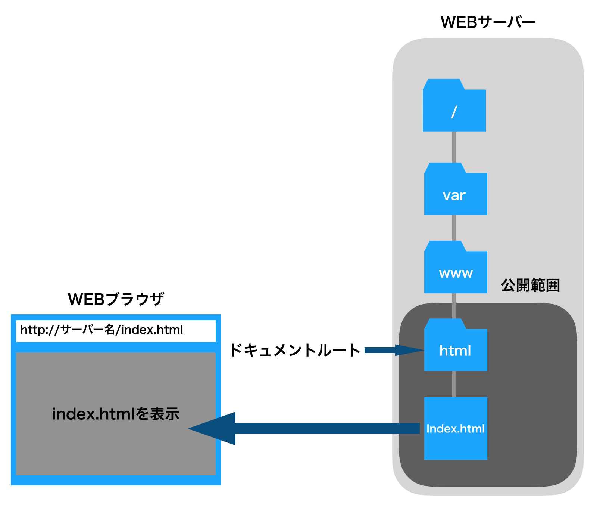
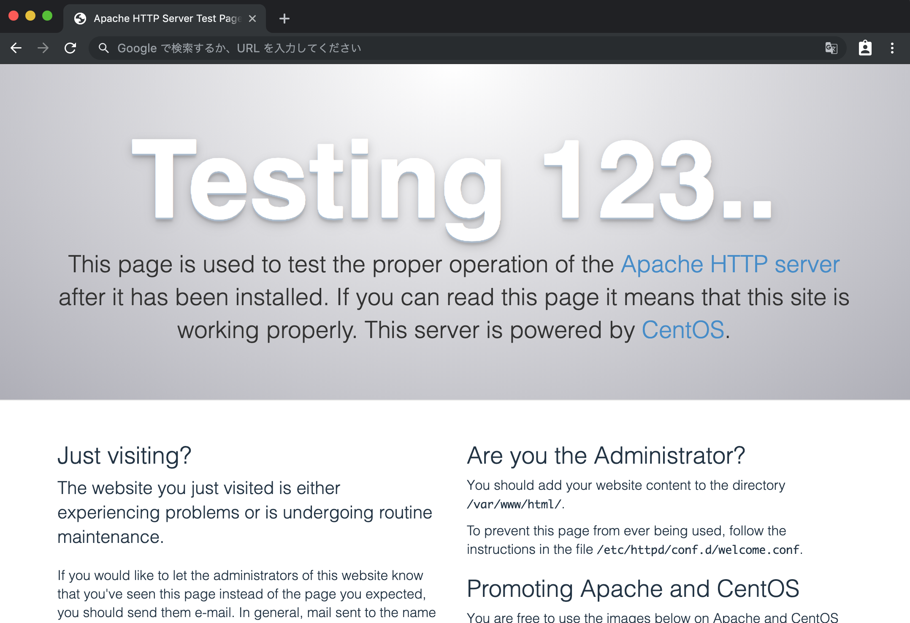
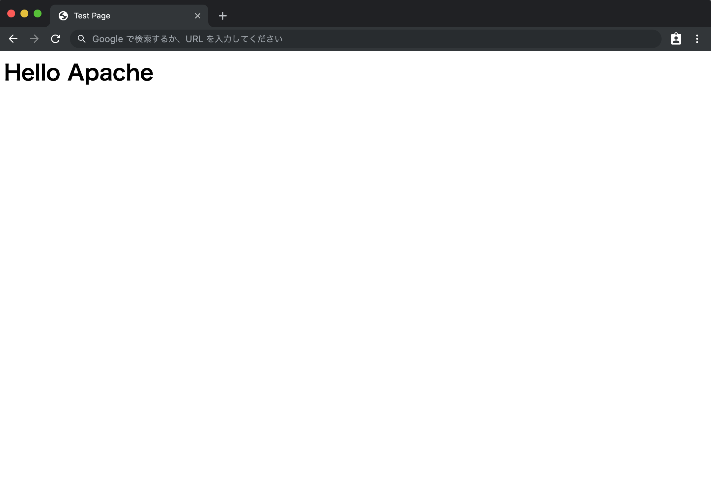

# Apacheの基本

ここではApacheの基本について紹介します。

## ■ ドキュメントルート

Webで公開するトップディレクトリを**ドキュメントルート**と呼ぶ。  
デフォルトでは、`/var/www/html` ディレクトリとなっている。  
つまり、`/var/www/html/index.html` ファイルを作成すると、「`http://サーバー名/index.html`」として外部からアクセスできる。

- ドキュメントルート  
    

ドキュメントルート以下は、ファイルの書き込みにはroot権限が必要です。

## ■ 設定ファイル httpd.conf

Apacheの設定ファイルは`/etc/httpd/conf/httpd.conf`である。  
下記では設定ファイルのごく一部を挙げている。

- httpd.confファイルの一部  

    ``` shell
    # ServerRoot: The top of the directory tree under which the server's
    # configuration, error, and log files are kept.
    #
    # Do not add a slash at the end of the directory path.  If you point
    # ServerRoot at a non-local disk, be sure to specify a local disk on the
    # Mutex directive, if file-based mutexes are used.  If you wish to share the
    # same ServerRoot for multiple httpd daemons, you will need to change at
    # least PidFile.
    #
    ServerRoot "/etc/httpd"
    ```

`#` で始まる行はコメントアウトです。  
上の例では、`ServerRoot "/etc/httpd"` が設定です。

- 書式  
    `ディレクティブ 設定値`

ディレクティブとは設定項目のことである。  
Apacheの設定では、設定変更に必要なディレクティブを確認し、その設定値を変更します。

- 主なディレクティブ

|ディレクティブ|説明|
|---|---|
|`ServerRoot`|設定ファイル等を配置するトップディレクトリ|
|`Listen`|Apacheが待ち受けるポート番号|
|`User`|Apacheの実行ユーザー|
|`Group`|Apacheの実行グループ|
|`ServerAdmin`|Apacheの管理者|
|`ServerName`|Webサーバー名|
|`DocumentRoot`|ドキュメントルート|
|`DirectoryIndex`|インデックスファイル名|

### ● ServerRoot

設定ファイル等を配置するトップディレクトリを指定する。  
httpd.conf ファイル内で相対するパスを指定すると、このディレクトリが起点となる。  
基本的に変更する必要はない。

- ServerRoot の設定例

    ``` shell
    ServerRoot "/etc/httpd"
    ```

### ● Listen

Apacheが待ち受けるポート番号を指定する。  
Webサーバーは通常80番ポートを使用しますので、通常は変更する必要はない。

- Listen の設定例

    ``` shell
    Listen 80
    ```

### ● User / Group

Apacheの実行ユーザーとグループを指定する。  
デフォルトではapacheユーザーとapacheグループが指定されている。  
Apacheが扱うコンテンツは、ここで指定したユーザー、グループが利用できるアクセス権が設定されている必要がある。  
基本的に変更する必要はない。

- User / Group の設定例

    ``` shell
    User apache
    Group apache
    ```

### ● ServerAdmin

Apacheが稼働しているサーバーの管理者のメールアドレスを指定する。  
デフォルトのままでも問題はない。

- ServerAdmin の設定例

    ``` shell
    ServerAdmin root@localhost
    ```

### ● ServerName

Webサーバーの名前を指定する。  
このディレクティブは、デフォルトではコメントアウトされている。  
ここにはホスト名を指定すれば良い。  
`:80` のようにポートを指定することもできるが省略してもかまわない。

- ServerName の設定例

    ``` shell
    ServerName www.example.com
    ```

### ● DocumentRoot

ドキュメントルートを絶対パスで指定する。  
ここで指定したディレクトリ以下は、UserおよびGroupで指定したユーザー、グループがアクセスできる必要がある。

- DocumentRoot の設定例

``` shell
DocumentRoot "var/www/html"
```

### ● DirectoryIndex

URLでファイル名まで指定されなかった時、インデックス(索引)ファイルとしてWebブラウザに送るファイル名を指定します。  
通常は`index.html`や`index.php`といったファイルが使用される。

- DirectoryIndex の設定例

    ``` shell
    DirectoryIndex index.html
    ```

## ■ 設定の変更

ここでは、ServerNameのみ設定する。  
このディレクティブが設定されていないと、Apache起動時に警告エラーが表示される。

- httpd.conf を編集

    ``` shell
    $ sudo vi /etc/httpd/conf/httpd.conf
    ```

- httpd.conf の編集
    - 変更前

        ``` shell
        #ServerName www.example.com:80
        ```

    - 変更後

        ``` shell
        ServerName www.example.com
        ```

- 構文チェック  
`httpd -t` を実行する事で設定ファイルのシンタックスチェックが可能である。  
実行結果に『 Syntax OK 』と表示されれば問題ない。

    ``` shell
    $ httpd -t
    Syntax OK
    ```

    - エラーメッセージ

        ``` shell
        $ httpd -t
        AH00526: Syntax error on line 95 of /etc/httpd/conf/httpd.conf:
        Invalid command 'erverName', perhaps misspelled or defined by a module not included in the server configuration
        ```

        ここでは95行目が文法エラーを指摘しています。  
        `erverName` は無効だよと指摘しているので正しく修正しましょう。

## ■ Apacheの起動

Apacheを起動します。

- Apache の起動

    ``` shell
    $ sudo systemctl start httpd
    ```

- Apache を自動的に起動

    ``` shell
    $ sudo systemctl enable httpd
    ```

Apacheを起動すると複数のプロセスが生成される。  
サーバーにアクセスがあってからプロセスを起動するとラグが生じてしまうので、あらかじめいくつかの予備プロセスを起動しておくことで、スムーズに応答が進むようになっている。

- httpd プロセスを表示

    ``` shell
    $ ps ax | grep httpd
    5416 ?        Ss     0:00 /usr/sbin/httpd -DFOREGROUND
    5417 ?        S      0:00 /usr/sbin/httpd -DFOREGROUND
    5418 ?        S      0:00 /usr/sbin/httpd -DFOREGROUND
    5419 ?        S      0:00 /usr/sbin/httpd -DFOREGROUND
    5420 ?        S      0:00 /usr/sbin/httpd -DFOREGROUND
    5421 ?        S      0:00 /usr/sbin/httpd -DFOREGROUND
    5472 pts/0    R+     0:00 grep --color=auto httpd
    ```

## ■ ファイアウォールの設定

デフォルトのファイアウォールの設定では、Webサーバーへのアクセスは許可されない。  
そのため、Apacheを起動しただけでは外部からアクセスはできない。  
ファイアウォールの設定を変更し、80番ポートのアクセスを許可します。  
ファイアウォールの設定では、`firewall-cmd` コマンドを使う。

- ファイアウォールの設定変更

    ``` shell
    $ sudo firewall-cmd --permanent --add-service=http
    success

    $ sudo firewall-cmd --reload
    success
    ```

これでWebブラウザからアクセスできます。  
Webブラウザのアドレス欄で「`http://IPアドレス/`」を入力してください。  
テストページが出れば成功。

- Apacheのテストページ  
    

## ■ HTMLファイルの作成

HTMLファイルを作成し、それを表示させる。  

- index.html の作成

    ``` shell
    $ sudo vi /var/www/html/index.html
    ```

- index.html の記述

    ``` html
    <html>
    <head>
        <title>Test Page</title>
    </head>
    <body>
        <h1>Hello Apache</h1>
    </body>
    </html>
    ```

保存したら再度アクセスをしてみる。

- テストページ(index.html)の表示  

    

<a href="../../README.md">戻る➡︎</a>
