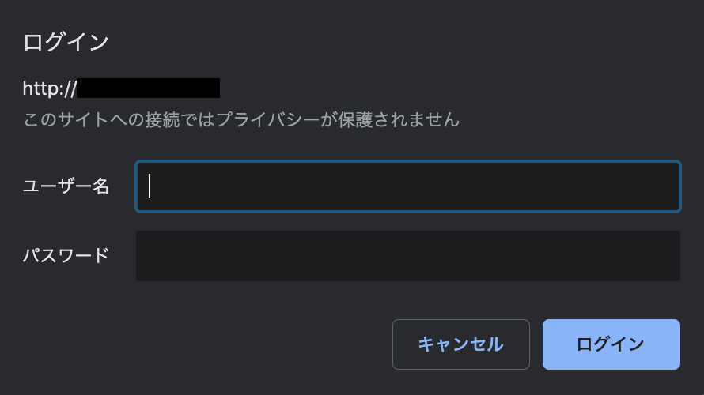

# パスワード認証の設定

ここではパスワード認証の設定について紹介します。

## ■ 基本認証

ユーザー名とパスワードを入力しなければWebページを見られないようにするにはいくつか方法があるが、もっとも簡単な方法が基本認証(BASIC認証)という仕組みである。  
BASIC認証はあらかじめApacheにユーザー名とパスワードを登録しておき、特定のディレクトリ以下にアクセスがあれば認証を求めるという仕組みである。

- 参考  
    基本認証と似た仕組みにダイジェスト認証が存在する。  
    ダイジェスト認証の方が安全性が高い。  
    BASIC認証は認証データがそのままインターネット上に流れるため、万が一盗聴されるとパスワード等が漏洩してしまう恐れがある。

BASIC認証を利用するには、まずユーザーをApacheに登録しておく。  
今回は、ユーザー名とパスワードを登録するファイルを「`/etc/httpd/conf.d/htpasswd`」、ユーザー名を「`webuser`」とする。  
初回のみ`-c` オプションを使用する。(ファイル生成がされる)

- 書式  
    `htpasswd [-c] ファイル名 ユーザー名`

### 1. 認証用のユーザーを登録

``` shell
$ sudo htpasswd -c /etc/httpd/conf.d/.htpasswd webuser
New password: [認証したいパスワード]
Re-type new password: [パスワード再入力]
Adding password for user webuser
```

- ユーザー追加

    ``` shell
    $ sudo htpasswd /etc/httpd/conf.d/.htpasswd webuser2
    ```

- ユーザー削除

    ``` shell
    $ sudo htpasswd -D /etc/httpd/conf.d/.htpasswd webuser2
    ```

### 2. パスワード内容の確認

``` shell
$ sudo cat /etc/httpd/conf.d/.htpasswd
```

ユーザー名と暗号化されたパスワードが保管されている。

### 3. アクセス権の変更

暗号化されたとしても、外部に流出すると簡単にパスワードが特定されてしまう。  
今回は、Apache用に作成した、apacheユーザーとapacheグループのみアクセスできるように設定します。  
(Apacheの実行ユーザーは「`/etc/httpd/conf/httpd.conf`」で確認できる)

``` shell
$ sudo chown apache /etc/httpd/conf.d/.htpasswd
$ sudo chgrp apache /etc/httpd/conf.d/.htpasswd
$ sudo chmod 600 /etc/httpd/conf.d/.htpasswd
```

### 4. BASIC認証の適用

どのディレクトリに対してBASIC認証を適用するかを設定する。  
設定は、「`/etc/httpd/conf.d/auth.conf`」に記述する。  
`/etc/httpd/conf.d` に配置された「`〜.conf`」ファイルは、追加ファイルとして`httpd.conf` 内に読み込まれる。

``` shell
$ sudo vi /etc/httpd/conf.d/auth.conf
```

- /etc/httpd/conf.d/auth.conf

    ``` shell
    <Directory "/var/www/html">
        AuthType Basic
        AuthName "Private Area"
        AuthUserFile /etc/httpd/conf.d/.htpasswd
        Require valid-user
    </Directory>
    ```

`<Directory>〜</Directory>` に囲まれたエリアに、特定のディレクトリ以下に適用する設定を記述する。  
今回はドキュメントルートを指定したが、任意のディレクトリを指定することもできる。

- BASIC認証の設定

    |ディレクティブ|説明|
    |---|---|
    |`AuthName`|BASICを指定すると基本認証|
    |`AuthName`|認証名(ブラウザに表示)|
    |`AuthUserFile`|パスワードファイル|
    |`Require`|認証ユーザー(`valid-user`はパスワードファイルに書かれた全ユーザー)|

### 5. 設定ファイルの再読み込み

設定を変更したら、Apacheに設定ファイルを再読み込みさせて反映させる必要がある。

``` shell
$ sudo systemctl reload httpd
```

または、

``` shell
$ sudo systemctl restart httpd
```

- 参考  
    再起動をかけてもいいが、接続中の処理に影響がでる可能性がある。

### 6. ブラウザ確認

Webページからアクセスしてみましょう。  
認証ウィンドウが出れば成功です。



<a href="../../README.md">戻る➡︎</a>
